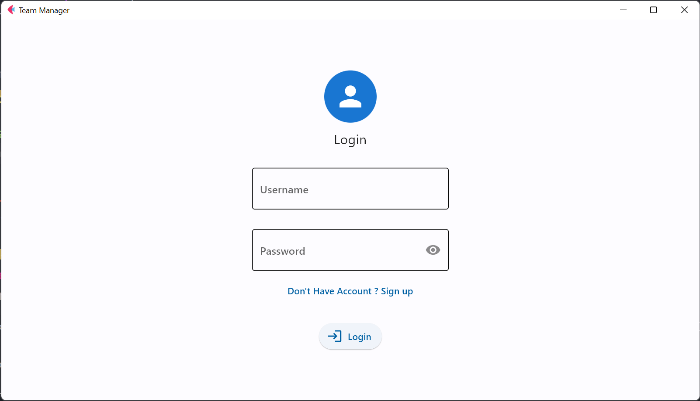
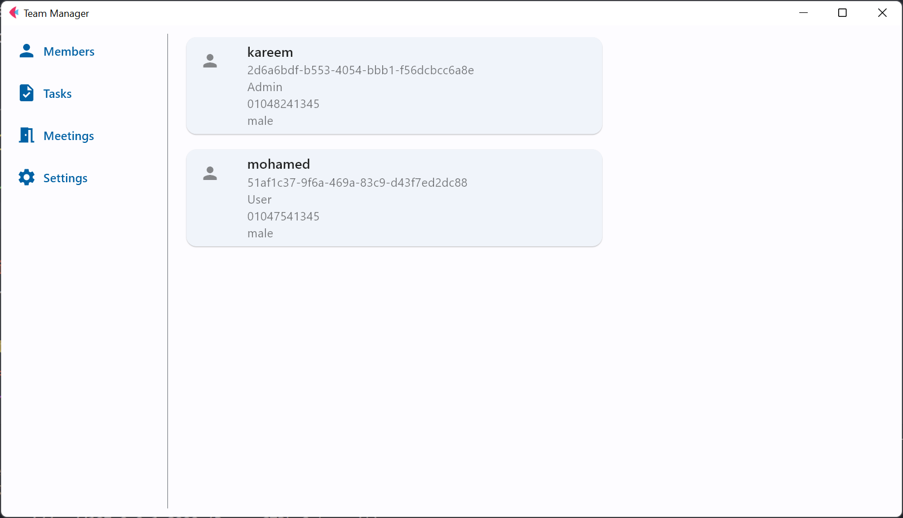
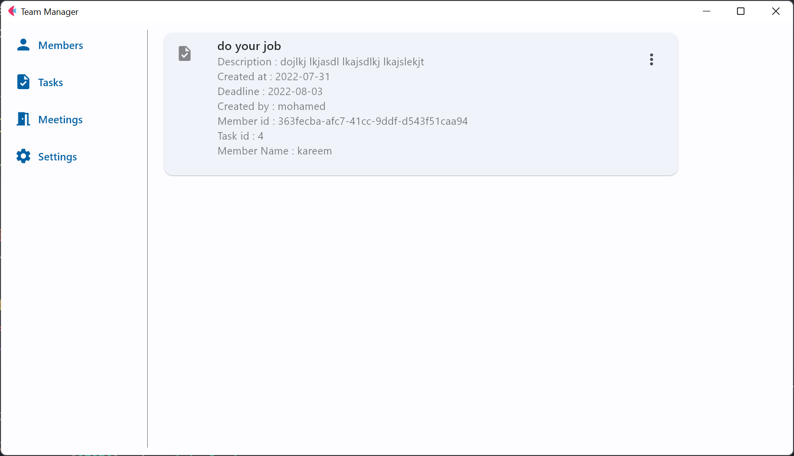
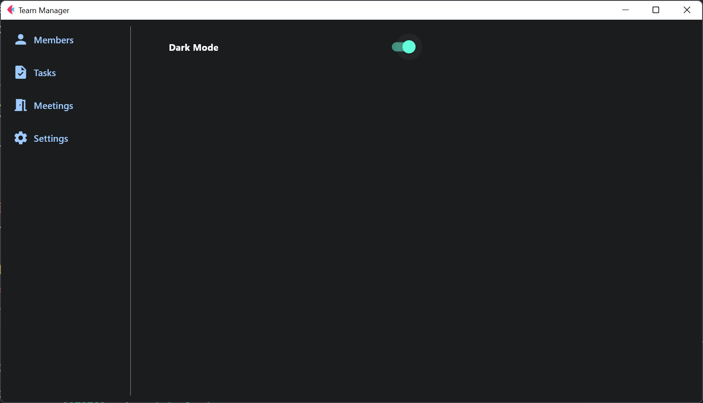

# Team Manager

Team Manager is a simple project that combines two new (ish) frameworks , Flet and FastAPI , it is not complete and it is not perfect as the aim of it is to give you some insight and encourage you to try Flet and FastAPI
## Project Build
* Fronted with Flet 
* Backend API with FastAPI
* Backend Database with Postgresql

## Login Page

## Members Dashboard

## Tasks Dashboard

## Settings Dashboard

